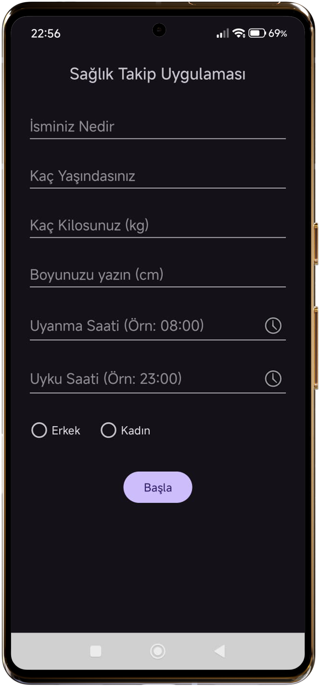
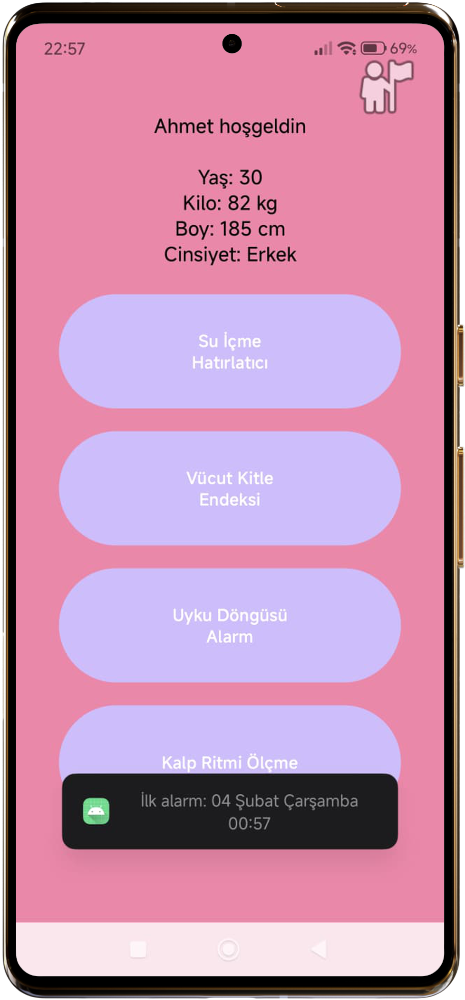
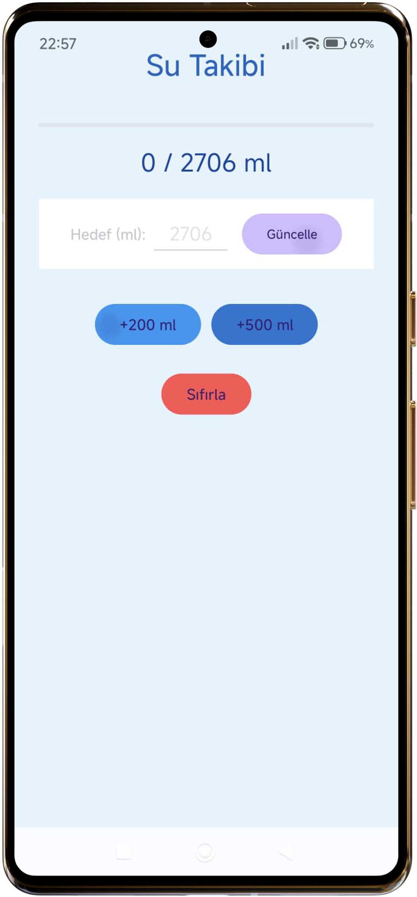
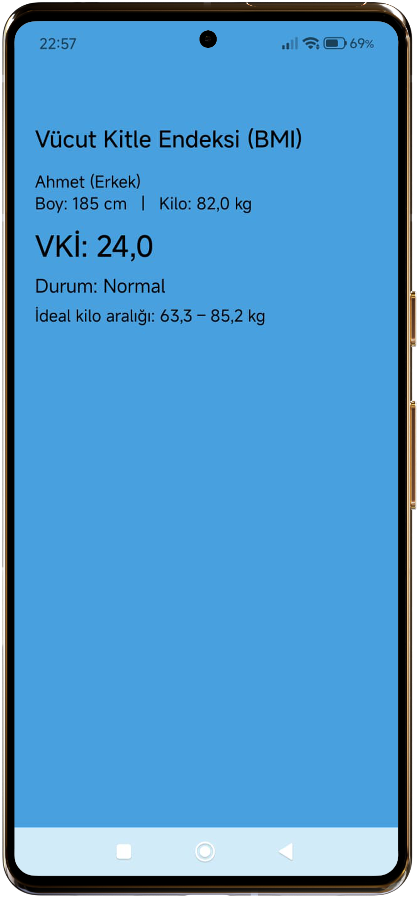
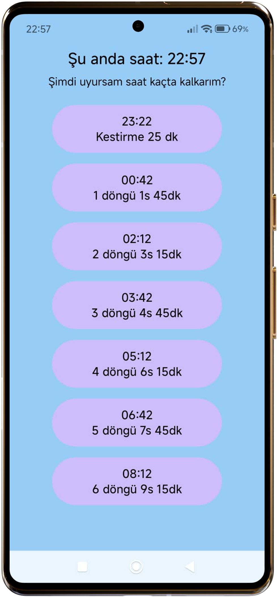

# Sağlık Takip Uygulaması

Android tabanlı kişisel sağlık  takip uygulaması.

## 📱 Özellikler

- 💧 **Su İçme Takibi**: Günlük su tüketimi hedefi ve hatırlatıcı
- 🏋️ **Vücut Kitle Endeksi**: BMI hesaplama
- 😴 **Uyku Döngüsü**: Uyku saati hatırlatıcı ve takip

## 🛠️ Teknolojiler

- Java
- Android SDK
- SharedPreferences (veri saklama)
- Material Design

## 📸 Ekran Görüntüleri

  
  
  
  
  

## 📝 Yapılacaklar

- [ ] Room Database entegrasyonu
- [ ] Grafikler ekleme
- [ ] Bildirim sistemi
- [ ] **Kalp Ritmi**: Nabız ölçümü

## 👨‍💻 Geliştirici

**Oğulcan KOÇ**  
[GitHub](https://github.com/ogulcankoc) | [LinkedIn](https://www.linkedin.com/in/ogulcan-koc/)

## 📄 Lisans

Bu proje eğitim amaçlıdır.
