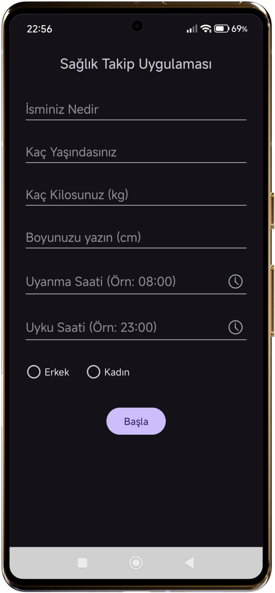
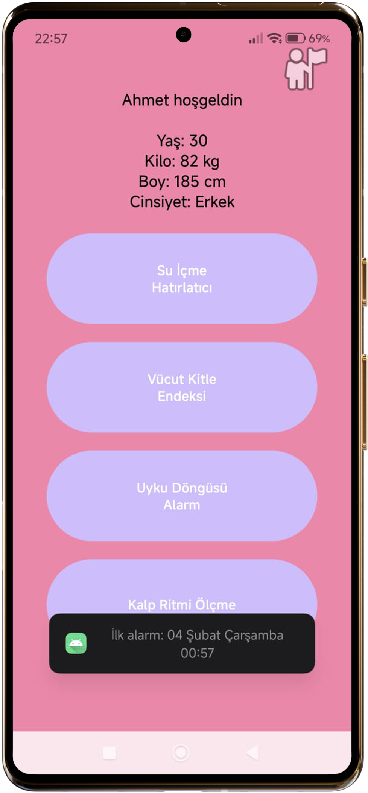
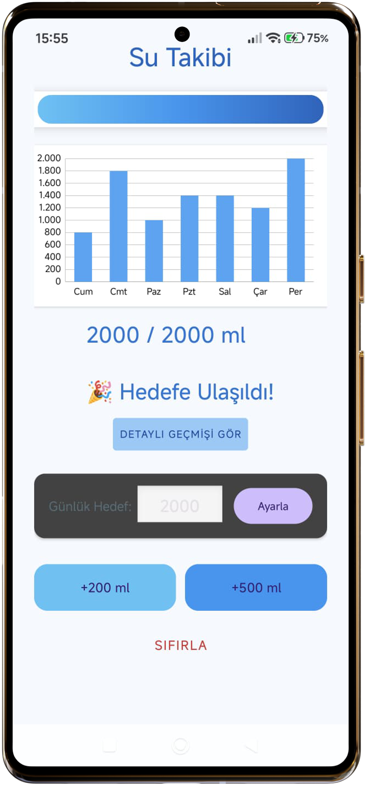
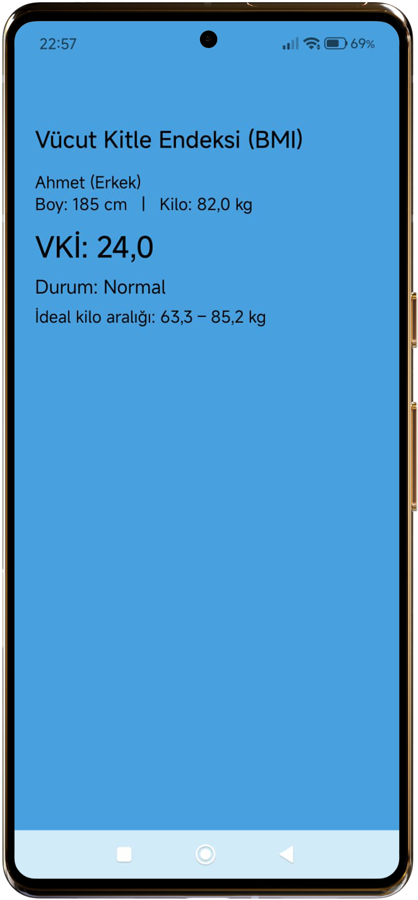
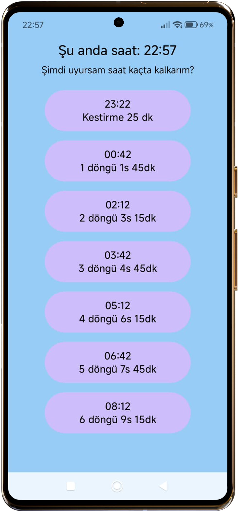
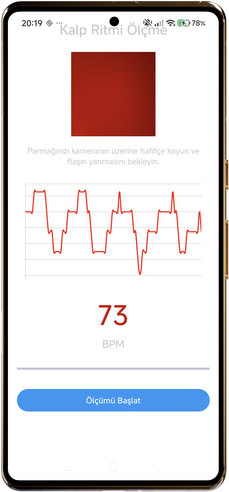

# Sağlık Takip Uygulaması

Android tabanlı kişisel sağlık  takip uygulaması.

## 📱 Özellikler

- 💧 **Su İçme Takibi**: Grafiksel olarak günlük su tüketimi takibi ve günlük olarak su içme hatırlatıcıları
- 🏋️ **Vücut Kitle Endeksi**: Kullanıcıdan alınan bilgilere göre BMI hesaplama ve bilgilendirme
- 😴 **Uyku Döngüsü**: Uyku saatine göre uyku döngülerine uygun uyanma saatlerinin belirlenmesi
- ❤️ **Nabız Tespiti**: Telefonun Kamerası ve flaşı kullanılarak PPG yöntemi ile nabız tespiti

## 🛠️ Teknolojiler

- Java
- Android SDK
- SharedPreferences (veri saklama)
- Material Design
- Room Database Entegrasyonu veri kaydetme ve Grafiksel Görselleştirme

## 📸 Ekran Görüntüleri

  
  
  
  
  
  

## 📝 Yapılacaklar

- [✅] Room Database entegrasyonu
- [✅] Grafikler ekleme
- [✅] Hatırlatma Bildirim sistemi
- [✅] **Kalp Ritmi**: Nabız ölçümü

## Geliştirici

**Oğulcan KOÇ**  
[LinkedIn](https://www.linkedin.com/in/ogulcan-koc/)

## 📄 Lisans

Bu proje eğitim amaçlı olarak geliştirilmektedir.
